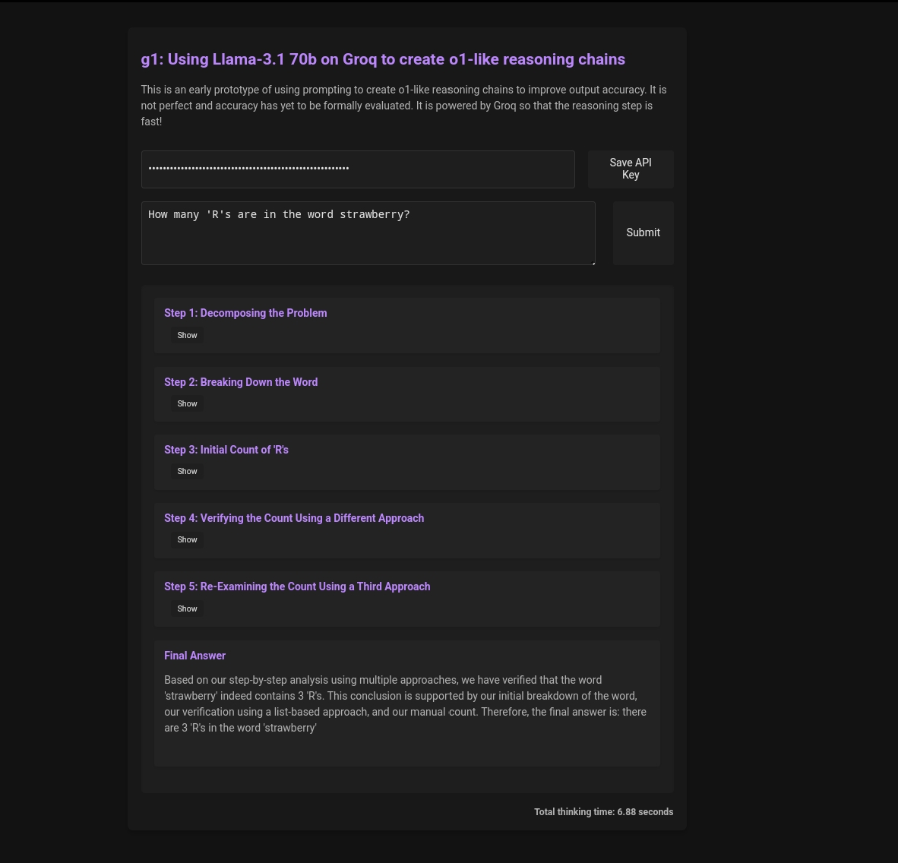

# g1 Chat

A modern AI chat interface with chain-of-thought reasoning, powered by Groq's fast inference.

Original: https://github.com/bklieger-groq/g1

## Features

- **Chat Interface**: Modern, responsive chat UI for natural conversations
- **Follow-up Questions**: Full conversation context maintained for follow-up questions
- **Chain-of-Thought Reasoning**: Watch the AI think step-by-step before answering
- **Collapsible Steps**: View or hide reasoning steps for each response
- **New Chat**: Start fresh conversations with the "+" button
- **Settings Panel**: Configure API key, model, and retry settings
- **Activity Log**: Monitor backend activity and API calls

## How It Works

This chat app uses prompting techniques to create o1-like reasoning chains. When you ask a question:

1. The AI thinks through the problem step-by-step
2. Each thinking step is displayed (collapsible)
3. After reasoning, a final answer is provided
4. The conversation history is maintained for follow-up questions

## Getting Started

1. Click the Settings icon (⚙️) in the header
2. Enter your Groq API key
3. Click "Save Settings"
4. Start chatting!

## Technology

- Pure HTML, CSS, and JavaScript (no build step required)
- Powered by Groq for fast inference
- Uses `markdown-it` for rendering responses
- OpenAI-compatible API

